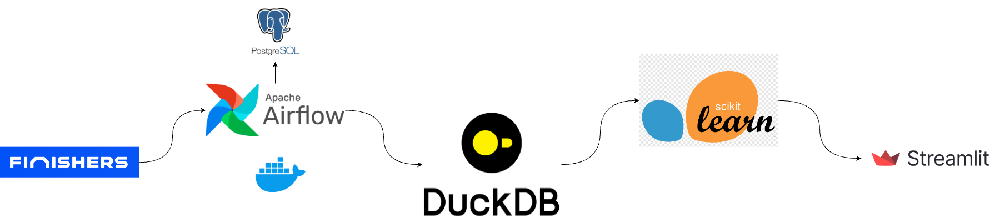

[](https://github.com/thibtd/DataEng_UTMB_pipeline/actions/workflows/main.yml) [](https://github.com/thibtd/DataEng_UTMB_pipeline/actions/workflows/dataPipeline.yml)
# UTMB Event Data Pipeline & Recommender System

A comprehensive system that extracts race information from UTMB (Ultra-Trail du Mont-Blanc) World Series events and provides personalized race recommendations.

## Project Overview

This project consists of two main components:
1. A data pipeline that automatically extracts data from Finishers.com
2. A recommender system with an interactive web interface for personalized race suggestions

### Data pipeline:




### Features:
- Automated data extraction from UTMB World Series events retrieved on finishers.com
- Machine learning-based race recommendations
- Interactive web interface for exploring races
- Visualization of race locations and characteristics
- Customizable search based on user preferences

Technologies used:
- Apache Airflow for workflow orchestration
- Selenium for web scraping
- PostgreSQL & DuckDB for data storage
- Streamlit for web interface
- Scikit-learn for machine learning
- Folium for interactive maps
- Docker for containerization

## Project Structure

```
utmb_data_eng/
├── dags/              # Airflow DAG definitions
├── plugins/           # Custom plugins and pipeline code
│   ├── recommender.py # Race recommendation system
│   └── utils.py      # Utility functions
├── app.py            # Streamlit web application
├── config/           # Configuration files
├── data/            # Data storage
├── tests/           # Test files
├── bash_files/      # Shell scripts
├── logs/            # Log files
└── docker-compose.yaml
```

## Prerequisites

- Docker
- Docker Compose
- Make (optional, for using Makefile commands)

## Quick Start

1. Clone the repository:
```bash
git clone <repository-url>
cd utmb_data_eng
```

2. Start the services:
```bash
make start_docker
# or
bash bash_files/start.sh
```

3. Access Airflow UI:
- URL: http://localhost:8080
- Username: airflow
- Password: airflow

4. Run the pipeline:
```bash
make run_dag
```

## Pipeline Components

1. **Extract**: 
   - Scrapes UTMB race data from Finishers.com
   - Navigates through multiple pages of events
   - Handles dynamic content loading using Selenium

2. **Transform**: 
   - Cleans and structures race information
   - Processes distances and creates distance-specific flags
   - Parses dates into start/end dates and duration
   - Extracts race styles and disciplines into separate columns
   - Generates geographic coordinates for race locations

3. **Load**: 
   - Saves processed data to CSV format
   - Stores data in DuckDB for efficient querying
   - Maintains table 'UTMB' with latest race information

4. **Recommend**:
   - K-means clustering of races based on features
   - Cosine similarity for finding similar races
   - User preference-based filtering
   - Interactive visualization of recommendations

## Using the Recommender System

1. Start the Streamlit app:
```bash
streamlit run app.py
```

2. Access the web interface:
- Navigate to the provided local URL (typically http://localhost:8501)
- Use the "Overview" tab to explore all races
- Use the "Get recommendations" tab to get personalized suggestions

3. Enter your preferences:
- Desired race distance
- Preferred race style and discipline
- Target date and location
- Single-day or multi-day event preference

4. View recommendations:
- See suggested races on an interactive map
- Explore race details and images
- Access direct links to race websites
- Understand recommendation explanations through feature importance visualization

## Development

- Install dependencies: `make install`
- Run tests: `make test`
- Format code: `make format`
- Lint code: `make lint`

## Stopping the Services

```bash
make stop_docker
# or
bash bash_files/take_down.sh
```

## License

This project is licensed under the Apache License 2.0 - see the [LICENSE](http://www.apache.org/licenses/LICENSE-2.0) file for details.
